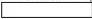
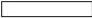
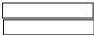

Questionnaire CSQ

|  Section 4.2: General information on purchase/payment  |   |   |   |   |
| --- | --- | --- | --- | --- |
|  Question no. | Question description and code structure |   |   | Recorded entry  |
|  Q4.2.4 | If code 1 in item Q4.2.3Whether any member of the household received following items free of cost during last 365 days? |   |   |   |
|   |  S. No. | item category | please select the check box if received free of cost during last 365 days  |   |
|   |  (1) | (2) | (3)  |   |
|   |  1. | Textbooks | □  |   |
|   |  2. | Stationary (geometry box, pen, notepad, etc.) | □  |   |
|   |  3. | School bag | □  |   |
|   |  4. | Other, if any | □  |   |
|  Q4.2.6 | If code 1 in item Q4.2.3Whether any member of the household received reimbursement/waiver of school/college fee during last 365 days?o yes-1, if yes, no. of members received reimbursement/waiver of school/college fee during last 365 days (number) o no-2 |   |   |   |
|  Q4.2.7 | Is one or more member of the household is a beneficiary of PradhanMantri Jan AarogyaYojana (Ayushman Bharat) or any other state specific public health scheme as on the date of survey?o yes-1, if yes, no. of beneficiaries (number) o no-2 |   |   |   |
|  Q4.2.8 | Whether any member of the household (including deceased former member of the household) has taken hospitalized treatment during last 365 days?o yes, in Government/Public hospital-1o yes, in Private (including Charitable/trust run) hospital-2o yes, in both Government & Private hospital-3o no-4 |   |   |   |
|  Q4.2.9 | Whether one or more member of the household has received benefits of medical treatment (medical – hospitalisation)under PradhanMantri Jan AarogyaYojana Card (Ayushman Bharat) or any other state specific public health scheme during the last 365 days?o yes-1, if yes, no. of members received benefits (number) and amount of expenditure incurred by the household (Rs.)o no-2 |   |   |   |
|  Q4.2.10 | Whether any online purchase/payment has been made to buy one or more of the following items (goods & services) during last 30 days? |   |   |   |
|   |  S. No. | item category | please select the check box if online purchase/payment done during last 30 days  |   |
|   |  (1) | (2) | (3)  |   |
|   |  1. | Fuel & light | □  |   |
|   |  2. | Toilet articles& other household consumables | □  |   |
|   |  3. | Education | □  |   |
|   |  4. | Medicine&other medical services | □  |   |
|   | 5. | Services (Travel, Recharges, Bill payment, Cinema/Theatre, internet, etc.) | □ |   |
|  • Go to Section 8  |   |   |   |   |

Household Consumption Expenditure Survey: 2023-24