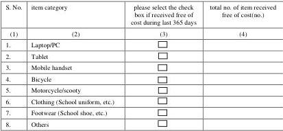

Questionnaire DGQ

|  Section 4.3: General information on purchase/payment  |   |   |   |
| --- | --- | --- | --- |
|  Question no. | Question description and code structure  |   |   |
|  Q4.3.2 | Whether one or more member of the household received following items free of cost through social-welfare programme of the Government or any other charitable organizationduring last 365 days?  |   |   |
|   |  S. No. | item category | please select the check box if received free of cost during last 365 days  |
|   |  (1) | (2) | (3)  |
|   |  1. | Laptop/PC |   |
|   |  2. | Tablet |   |
|   |  3. | Mobile handset |   |
|   |  4. | Bicycle |   |
|   |  5. | Motorcycle/scooty |   |
|   |  6. | Clothing (School uniform, etc.) |   |
|   |  7. | Footwear (School shoe, etc.) |   |
|   |  8. | Others |   |
|  Q4.3.3 | Whether the household possessed one or more of the following items as on the date of the survey?  |   |   |
|   |  S. No. | item category | please select the check box if possessed as on the date of survey  |
|   |  (1) | (2) | (3)  |
|   |  1. | Television |   |
|   |  2. | Radio |   |
|   |  3. | Laptop/PC |   |
|   |  4. | Mobile handset |   |
|   |  5. | Bicycle |   |
|   |  6. | Motorcycle, scooter |   |
|   |  7. | Motor car/jeep/van |   |
|   |  8. | Trucks |   |
|   |  9. | Animal cart |   |
|   |  10. | Refrigerator |   |
|   |  11. | Washing machine |   |
|   |  12. | Air conditioner/air cooler |   |
|  Q4.3.4 | If checked srl. no. 1, Q4.3.3,Which type of multichannel television facility is used by the household as on the date of the survey?  |   |   |
|  • Go to Section 13  |   |   |   |

Household Consumption Expenditure Survey: 2023-24