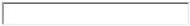
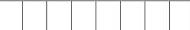
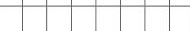
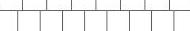

Questionnaire LCES

## SECTION 5: List of households and structures

Instructions for the JSO/FI: All the structures and households residing in a structure are to be listed. If the structure is used wholly for non-residential purposes or vacant, only fill-in questions 5.1 and 5.2 and proceed to the next structure. Only for households residing in the structure, fill-in all the questions.

|  item no. | item | number/code  |
| --- | --- | --- |
|  5.1 | house number:[census/ municipality/ local body/ panchayat house number if available; running serial number within bracket otherwise] |   |
|  5.2 | is the house used only for non-residential purposes?(Yes - 1, No - 2)If Yes, Go to item 5.1 of next row |   |
|  5.3 | household serial number:[only for houses/ structures used for residential purposes (Starting serial no is 1. Then continuous numbering without omission and duplication for each household listed). |   |
|  5.4 | name of head of the household |   |
|  5.5 | household size |   |
|  5.6 | area of land possessed (lp) in acre : (for rural only)[1 acre=0.405 hectare, 1 hectare=2.471 acre ] |   |
|  5.7 | Whether the household owns one or more four wheeler cars for non-commercial use?(for urban only)(Yes=1, No=2) |   |
|  5.8 | If 1 in item 5.7 then total purchase value of four wheeler cars (code)[value of car > 10 lakh=1 value of car ≤10 lakh=2] |   |
|  5.9 | Compute: SSS number |   |
|  5.10 | mobile number of head of the household |   |
|  5.11 | mobile number of any other member of the household |   |
|  5.12 | land line number of the household |   |
|  GO TO NEXT ROW  |   |   |

7